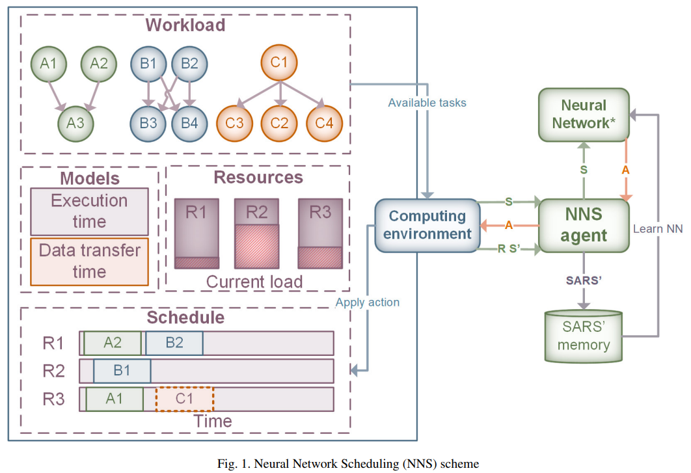

# NNScheduler
The project contains:
 - scheduling algorikthm of scientific workflow in cloud environment based on RL algorithms (DQN).
 - simulation of distributed cloud environment and workflow execution engine (discrete-event simulator).
The result were used in such paper as:
https://www.sciencedirect.com/science/article/pii/S1877050919310440/pdf?md5=40e12a7ff2db4170ee58f413871add2f&pid=1-s2.0-S1877050919310440-main.pdf




Project:
workflow_launch - main file with experiment scenario  
actor - parameters of Q-learning agent  
wf_gen_funcs - functions for building workflow's structure tree and random workflows  
env.context - desription of workflow scheduling problem, generation of state  
env.entities - nodes, tasks and performance models  

# Run Example
First you should load server-side with model using followed command with parameters
```
python server.py --actor-type=fc 
```

Second you should start client-side using command with parameters

```
python episode.py --num-episodes=1000 --wfs-name=Montage_100
```
